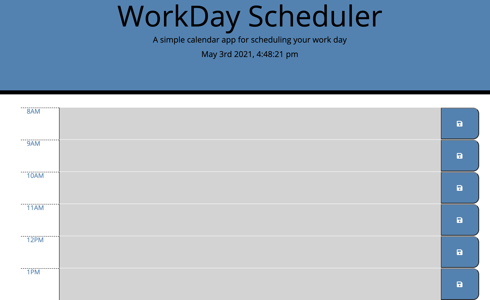

# Calender-Application

 

 

## Description

 

Schedule out every part of your workday with this workday scheduling application. Application functionality using JavaScript and jQuery was added on top of HTML, CSS, and Moment.js. This planners workdays span between 8AM and 5PM PST. Timeblocks are colored based on the current time, past hours are grey, current hour is red and future timeblocks are represented by green.

## Usage

 
- Once the site is launched users will see the current time and date at the top of the application. Below you will find blocks represented by a specific time on the left hand side and a blue "save" button on the right hand side.
 
 
- Within the middle of these blocks users can enter in text. Once you have finished entering text relevant to the time of day press the the blue button to save what was entered. 
 
 
- Text enterd and saved will stay on the page even if the user refreshes the page thanks to local storage.
 
 
- To remove content or text within a timeblock simply delete the text and press the save button once more.

## Notes

 
This application is updated in real time thanks the the API technologies of Moment.js!

## License

[MIT](https://choosealicense.com/licenses/mit/#)
